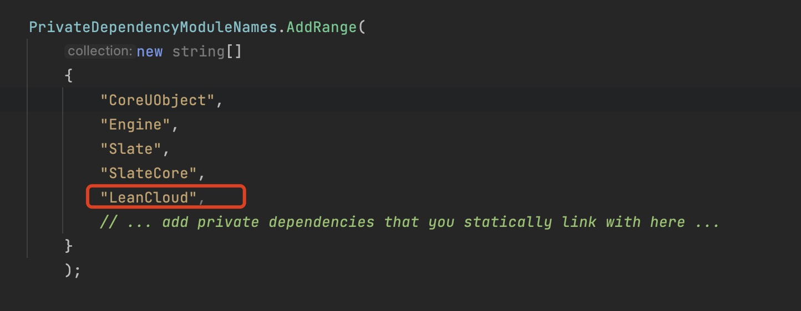
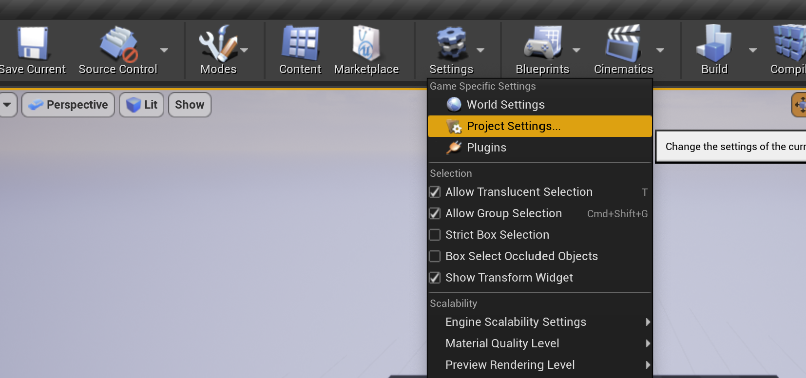
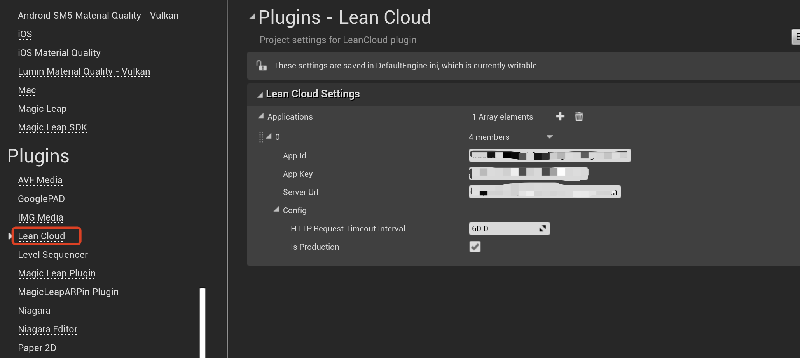

# LeanCloud-Unreal

## 安装 SDK

### 下载 SDK

可以从 [GitHub](https://github.com/leancloud/unreal-sdk/releases) 获取 SDK 。

### 导入插件

从下载的 SDK 中将 LeanCloud 插件拷贝到自己项目的插件目录中，如果下载的是项目工程，那么 LeanCloud 插件路径如下：`LeanCloudProject/Plugins/LeanCloud`

### 给 Module 添加依赖

在你想使用 LeanCloud 功能的 Module 中添加依赖，找到你当前 Module 的配置文件，即 `Module.build.cs` 文件。可以在该文件中的 `PublicDependencyModuleNames` 或者 `PrivateDependencyModuleNames` 数组中添加 `LeanCloud` 的依赖



这样 SDK 就集成完毕了。

## 初始化

初始化的方式有两种：[配置初始化](#配置初始化) 和 [代码初始化](#代码初始化)

### 配置初始化

我们可以通过编辑器 Project Setting 中的 LeanCloud 的配置来设置：



在上面打码的地方填上相关的配置。

### 代码初始化

导入头文件：
```cpp
#include "LCApplication.h"
```

初始化代码：
```cpp
FLCApplicationSettings Settings = FLCApplicationSettings();
Settings.AppId = "your-client-id";
Settings.AppKey = "your-client-token";
Settings.ServerUrl = "https://your_server_url";
FLCApplication::Register(Settings);
```

### 初始化多个应用

Unreal 支持多个应用的初始化：
- 在 [配置初始化](#配置初始化) 中，可以点 `+` 号，然后填写多个应用的配置。

- 在 [代码初始化](#代码初始化) 中，多次调用`FLCApplication::Register`方法来初始化就行。

初始化的应用对象（Application）会当成单例保存起来，多次初始化相同配置只会保存一份，我们通过如下代码来获取应用对象（Application）：
```cpp
TSharedPtr<FLCApplication> AppPtr = FLCApplication::Get("your-client-id");
```

我们会把第一个注册的配置设为默认配置，你也可以通过对象 `FLCApplication::DefaultPtr` 来设置或获取默认配置。

因为支持初始化多个应用，所以后续在 `FLCObject`、`FLCQuery`等类中，需要指定应用的配置，如果不指定，那么会使用默认的配置。


### 应用凭证

<AppConfig />

## 域名

<DomainBinding />

## 开启日志

我们可以通过接入日志代理回调，将信息打印到控制台来看调试信息，也可以将信息输入到 log 文件，以便线上应用追溯BUG。

```cpp
// 最好在 Application 初始化代码执行之前执行
FLCApplication::SetLogDelegate(FLeanCloudLogDelegate::CreateLambda([](ELCLogLevel LogLevel, const FString& LogMsg) {
switch (LogLevel) {
case ELCLogLevel::Error: 
  UE_LOG(LogTemp, Error, TEXT("%s"), *LogMsg);
  break;
case ELCLogLevel::Warning: 
  UE_LOG(LogTemp, Warning, TEXT("%s"), *LogMsg);
  break;
case ELCLogLevel::Debug:
  UE_LOG(LogTemp, Display, TEXT("%s"), *LogMsg);
  break;
case ELCLogLevel::Verbose:
  UE_LOG(LogTemp, Display, TEXT("%s"), *LogMsg);
  break;
default: ;
}
```

:::caution
在应用发布之前，请调高打印日志的级别，以免暴露敏感数据。
:::

## 验证

首先，确认本地网络环境是可以访问云端服务器的，可以执行以下命令：

```sh
curl "https://{{host}}/1.1/date"
```

`{{host}}` 为绑定的 API 自定义域名。

如果当前网络正常会返回当前时间：

```json
{ "__type": "Date", "iso": "2020-10-12T06:46:56.000Z" }
```


## 问题排查

SDK 安装指南基于当前最新版本的 SDK 编写，所以排查问题前，请先检查下安装的 SDK 是不是最新版本。

### `401 Unauthorized`

如果 SDK 抛出 `401` 异常或者查看本地网络访问日志存在：

```json
{
  "code": 401,
  "error": "Unauthorized."
}
```

则可认定为 `App ID` 或者 `App Key` 输入有误，或者是不匹配，很多开发者同时注册了多个应用，导致拷贝粘贴的时候，用 A 应用的 App ID 匹配 B 应用的 `App Key`，这样就会出现服务端鉴权失败的错误。

### 客户端无法访问网络

客户端尤其是手机端，应用在访问网络的时候需要申请一定的权限。


## 使用
* [数据存储](docs/storage.md)
