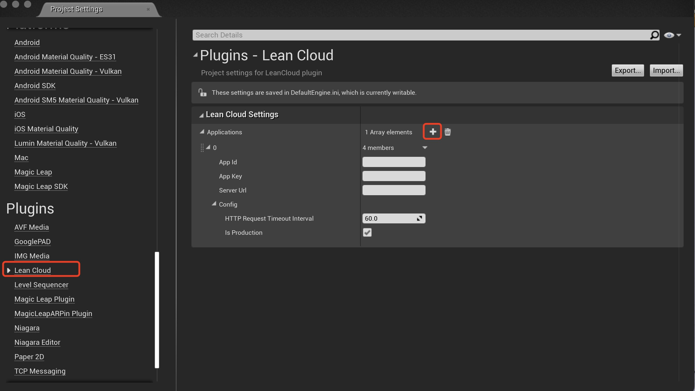

## 一般说明

### 问题：UE 游戏怎么初始化 SDK，才更符合游戏开发规范？

有两种初始化方式：
1. 使用代码初始化
```cpp
// 注册第一个应用
FLCApplicationSettings Settings("AppID", "AppKey", "ServerUrl");
Settings.Config.HTTPRequestTimeoutInterval = 30;
Settings.Config.bIsProduction = false;
FLCApplication::Register(Settings);

// 注册第二个应用ID
TSharedPtr<FLCApplication> AppPtr = FLCApplication::Register(FLCApplicationSettings("Other AppID", "Other AppKey"));
if (AppPtr.IsValid()) {
    // 初始化成功
}

// 获取已经注册过的应用
AppPtr = FLCApplication::Get("AppID");
if (AppPtr.IsValid()) {
    // 注册过的AppID应用
}

// 注销应用
AppPtr->Unregister();
```

2. 插件初始化
可以在项目设置中找到 *LeanCloud* 的设置项，然后添加 Application 的设置（可以添加多个）




## 初始化

LCApplication* LCApplication#GetInstance(String appId, String appKey, String serverUrl)

## Object 增删改接口

LCObject* LCApplication.GetObject(String className);
LCObject* LCApplication.GetObject(String className, String objectId);
void LCObject.Put(String key, Object& value)
void LCObject.Add(String key, Object& value)
void LCObject.AddUnique(String key, Object& value)
void LCObject.Remove(String key)
void LCObject.Increment(String key, double value)
void LCObject.Decrement(String key, double value)
void LCObject.BitAnd(String key, long value)
void LCObject.BitOr(String key, long value)
void LCObject.BitXor(String key, long value)

void LCObject.SetACL(LCACL& acl)
LCACL* LCObject.GetACL()

const Object* LCObject.Get(String key)
string& LCObject.GetString(String key)
int LCObject.GetInt(String key)
Bool LCObject.GetBool(String key)
List<Object>& LCObject.GetList(String key)
JsonObject& LCObject.GetJsonObject(String key)

Date& LCObject.GetUpdatedAt()
Date& LCObject.GetCreatedAt()
string LCObject.GetObjectId()

void LCObject.Fetch(LCSaveCallback callback)
void LCObject.Save(LCSaveCallback callback)
void LCObject.Delete(LCSaveCallback callback)


## Query 相关接口
LCQuery* LCApplication.GetQuery(String className)
LCQuery* LCQuery.WhereEqualTo(String key, Object& value)
LCQuery* LCQuery.WhereNotEqualTo(String key, Object& value)
LCQuery* LCQuery.WhereLessThan(String key, Object& value)
LCQuery* LCQuery.WhereGreaterThan(String key, Object& value)
LCQuery* LCQuery.WhereExists(String key)
LCQuery* LCQuery.WhereDoesNotExists(String key)
LCQuery* LCQuery.WhereContains(String key, Object& value)
LCQuery* LCQuery.WhereNear(String key, LCGeoPoint& value)

void LCQuery.Find(LCQueryCallback callback);

## File 相关接口
LCFile* LCApplication.GetFile();
void LCFile.SetData(Byte* bytes, int length);
void LCFile.Save(LCSaveCallback callback);

## User 相关接口

void LCApplication.LoginWithAuthData(Map dict, LCLoginCallback callback);
void LCApplication.BecomeWithSessionToken(String sessionToken, LCLoginCallback callback);
LCUser* LCApplication.GetCurrentUser();
void LCApplication.SetCurrentUser(LCUser* user);

LCUser* user = LCApplication.GetUser();
LCUser* user = LCApplication.GetUser(String userObjectId);

Bool LCUser.IsAuthenticated();
void LCUser.AssociateAuthData(String platform, Map dict, LCSaveCallback callback);
void LCUser.DisassociateWithAuthData(String platform, LCSaveCallback callback);

